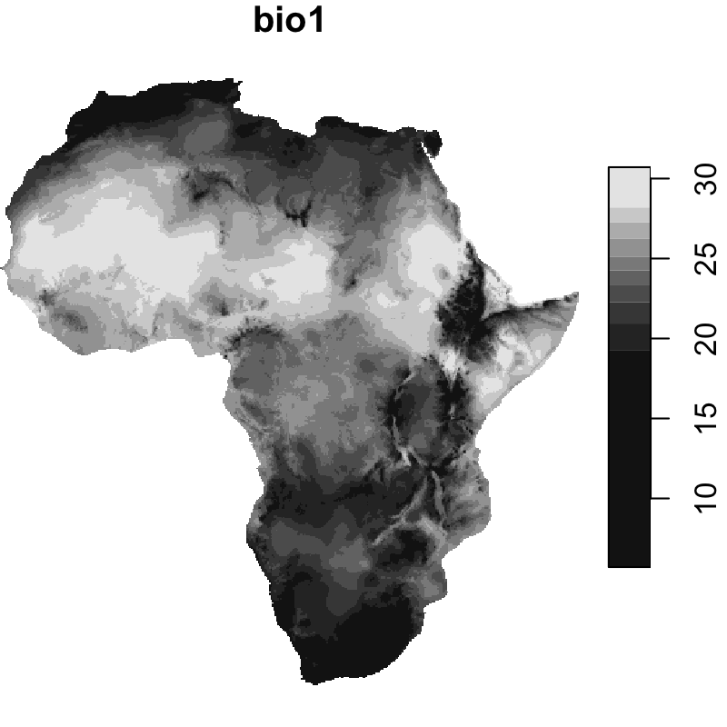

```{r, include = FALSE}
knitr::opts_chunk$set(
  collapse = TRUE,
  comment = "#>",
  warning = F
)
```

## Set up
```{r setup, warning=F, message=F, eval=T}
library(sf, quietly = T)
library(itsdm, quietly = T)
library(ggplot2, quietly = T)
library(dplyr, quietly = T)
select <- dplyr::select
```

## Prepare environmental variables

We could use package like `rnaturalearth` to easily get boundary of most of countries
and regions. You could also read your own study area boundary for sure. Providing 
boundary to function `worldclim2` would allow you to download files from worldclim 
version 2 with clipping to your own area.

```{r bios, eval=F}
library(rnaturalearth, quietly = T)

# Get Africa continent
af <- ne_countries(
  continent = 'africa', returnclass = 'sf') %>% 
  filter(admin != 'Madagascar') # remove Madagascar

# Union countries to continent
af_bry <- st_buffer(af, 0.1) %>%
  st_union() %>% 
  st_as_sf() %>% 
  rename(geometry = x) %>% 
  st_make_valid()
  
bios <- worldclim2(var = 'bio', bry = af_bry, nm_mark = 'africa')

# Plot BIO1
plot(bios %>% slice('band', 1), 
     main = st_get_dimension_values(bios, 'band')[1])
```

```{r, echo=F, fig.align='center'}

```

The `bios` generated by the code above is also saved in this package.
If you want to use exact the same data, you could directly use `system.file('extdata/bioclim_africa_10min.tif', package = 'itsdm')` to 
find it.

In species modeling, people usually want to remove the strong correlations between
environmental variables. `dim_reduce` is just such function that you need. The function
could either reduce the dimension of your environmental variable stack itself or according
to a bunch of observations. It also allows you to set a desirable threshold. Note that it only
works on numeric variables. Because categorical variables have less risk to have high correlation with others and usually we prefer to keep categorical variables.

```{r dim_reduction, warning=F, message=F}
library(stars, quietly = T)
# An example of reducing dimensions
## Read bios from package
bios <- system.file('extdata/bioclim_africa_10min.tif', package = 'itsdm') %>% 
  read_stars()

## Here we didn't set samples, so use whole image 
bios_reduce <- dim_reduce(
  bios, threshold = 0.6, 
  preferred_vars = c('bio1', 'bio12', 'bio5'))

# Returned ReducedImageStack object
bios_reduce

# Raster stack after dimension reduction
bios_reduce$img_reduced
```

## Creating the virtual species

Using virtual species is a crucial method in ecological studies. First, let's create a virtual species using package `virtualspecies` in order to know exactly what is going on. 

```{r virtualspecies, fig.align='center', fig.width=7, fig.height=6, warning=F, message=F}
library(here, quietly = T)
library(virtualspecies, quietly = T)

# Subset environmental variables to use
bios_sub <- bios %>% slice('band', c(1, 5, 12, 15))
bios_sub <- stack(as(split(bios_sub), 'Spatial'))

# Formatting of the response functions
set.seed(10)
my.parameters <- formatFunctions(
  bio1 = c(fun = 'dnorm', mean = 25, sd = 5),
  bio5 = c(fun = 'dnorm', mean = 35, sd = 5),
  bio12 = c(fun = 'dnorm', mean = 1000, sd = 500),
  bio15 = c(fun = 'dnorm', mean = 100, sd = 50))

# Generation of the virtual species
set.seed(10)
my.species <- generateSpFromFun(
  raster.stack = bios_sub,
  parameters = my.parameters,
  plot = F)

# Conversion to presence-absence
set.seed(10)
my.species <- convertToPA(
  my.species,
  beta = 0.7,
  plot = F)

# Plot maps
plot(my.species)
# And response curves
plotResponse(my.species)
```

## Generate pseudo samples for virtual species

```{r samples, fig.align='center', fig.width=5, fig.height=5}
# Sampling
set.seed(10)
po.points <- sampleOccurrences(
  my.species,
  n = 2000,
  type = "presence only")
po_df <- po.points$sample.points %>% 
  select(x, y) %>% 
  mutate(id = row_number())
head(po_df)
```

As we all know, there are commonly sampling bias and observation errors. People use multiple methods to reduce these disturbances in samples. As an example, here we use function `suspicious_env_outliers` to detect and/or remove possible environmental outliers. This step could be used with other strategies to do sample cleaning.

```{r remove_outliers, fig.align='center', fig.width=5, fig.height=5}
# Get environmental variable stack
## Here we added BIO6 and BIO13 as extra variables
variables <- bios %>% slice('band', c(1, 5, 6, 12, 13, 15))

# Check outliers
occ_outliers <- suspicious_env_outliers(
  po_df, 
  variables = variables,
  z_outlier = 5,
  outliers_print = 4L)

# Check result
## Multiple ways to plot outliers
plot(occ_outliers)
plot(occ_outliers, 
     overlay_raster = variables %>% slice('band', 6))

# Remove outliers if necessary
occ_outliers <- suspicious_env_outliers(
  po_df, variables = variables,
  rm_outliers = T,
  z_outlier = 5,
  outliers_print = 0L)
po_sf <- occ_outliers$pts_occ

# Make occurrences
set.seed(11)
occ_sf <- po_sf %>% sample_frac(0.7)
occ_test_sf <- po_sf %>% filter(! id %in% occ_sf$id)
occ_sf <- occ_sf %>% select(-id)
occ_test_sf <- occ_test_sf %>% select(-id)

# Have a look at the samples
ggplot() +
  geom_raster(data = as.data.frame(my.species$suitab.raster, xy = T),
              aes(x, y, fill = layer)) +
  scale_fill_viridis_c('Suitability', na.value = 'transparent') +
  geom_sf(data = occ_sf, aes(color = 'Train'), size = 0.8) +
  geom_sf(data = occ_test_sf, aes(color = 'Test'), size = 0.8) +
  scale_color_manual('', values = c('Train' = 'red', 'Test' = 'blue')) +
  theme_classic()
```

## Build a simple `isolation_forest` species distribution model

Here we build a SDM using extended isolation forest (with `ndim = 2`).

```{r sdm, fig.align='center', fig.width=4, fig.height=3}
# Do modeling
it_sdm <- isotree_po(occ = occ_sf, 
                     occ_test = occ_test_sf, 
                     variables = variables,
                     sample_rate = 0.8,
                     ndim = 2)
```

Let's compare the predicted suitability with real suitability.

```{r prediction, echo = F, fig.align='center', fig.width=5.3, fig.height=4.3}
# Compare with virtual species
ggplot() +
  geom_stars(data = it_sdm$prediction) +
  scale_fill_viridis_c('Predicted suitability',
                       na.value = 'transparent') +
  coord_equal() +
  theme_linedraw()
```

```{r raw_suit, echo = F, fig.align='center', fig.width=5, fig.height=4}
ggplot() +
  geom_raster(data = as.data.frame(my.species$suitab.raster, xy = T),
              aes(x = x, y = y, fill = layer)) +
  scale_fill_viridis_c('Real suitability',
                       na.value = 'transparent') +
  coord_equal() +
  theme_linedraw()
```

Let's do model evaluation using multiple presence-only metrics. In this package, we only implement presence-only evaluation metrics, the users also could calculate other presence-absence metrics using other packages or so.

```{r, fig.align='center', fig.width=6, fig.height=6}
# Metrics based on training dataset
it_sdm$eval_train
plot(it_sdm$eval_train)

# Metrics based on test dataset
it_sdm$eval_test
plot(it_sdm$eval_test)
```

The result of `isotree_po` has options to generate response curves and variable analysis together. The response curves include marginal response curves, independent response curves and variable dependence made by SHAP. Variable analysis includes Jackknife of Pearson correlation with result of full model with all variables and AUC_ratio and variable dependence with SHAP test.

```{r marginal_responses, fig.align='center', fig.width=7, fig.height=7}
# Plot response curves
## Marginal response curves of all variables
plot(it_sdm$marginal_responses)
```

```{r independent_responses, fig.align='center', fig.width=7}
## Independent response curves of variable bio1, bio12, and bio15.
plot(it_sdm$independent_responses, target_var = c('bio1', 'bio12', 'bio15'))
```

```{r variable_dependence, fig.align='center', fig.width=7, fig.height=7}
## Variable dependence scatter points with fitted curves made by SHAP test
plot(it_sdm$variable_dependence)
```

```{r variable_analysis, fig.align='center', fig.width=8, fig.height=8}
# Printing variable analysis could give you enough info of variable importance
it_sdm$variable_analysis

# We also could plot variable importance out
plot(it_sdm$variable_analysis)
```

The direct result of function `isotree_po` is the environmental suitability. We could use function `convert_to_pa` to convert suitability to presence-absence based on different methods: threshold, logistic, and linear conversion, and/or a desirable species prevalence.

```{r pa, fig.align='center', fig.width=8, fig.height=8}
# An example of converting to presence-absence map
## Use logistic conversion with alpha = -0.05, beta = 0.5 
## and not set species prevalence
pa_map <- convert_to_pa(it_sdm$prediction,
                        method = "logistic",
                        beta = 0.5,
                        alpha = -.05)
pa_map; plot(pa_map)
```

## Analyze vairable dependence

It is always helpful to understand the dependence among variables. The result of function `variable_dependence` or `it_sdm$variable_dependence` can be used to analyze variable dependence. 

```{r var_inter_dependence, fig.align='center', fig.width=7, fig.height=6}
var_dependence <- variable_dependence(
  it_sdm$model, 
  it_sdm$var_train %>% st_drop_geometry())

# Multiple ways to plot variable VariableDependence object
## Plot without smooth fit curve
plot(var_dependence, 
     target_var = c('bio1', 'bio12', 'bio15'),
     related_var = 'bio13', smooth_span = 0)
```

## Analyze variable contribution

Sometimes, we are interested in some observations, for instance, the outliers. `variable_dependence` is such function that allows you analyze the contribution of each variable. It relies on Shapley value.

```{r var_contrib, fig.align='center', fig.width=7, fig.height=7}
## Analyze variable contribution for interested observations.
## For example, outliers.
var_contrib <- variable_contrib(
  it_sdm$model, 
  it_sdm$var_train %>% st_drop_geometry(),
  it_sdm$var_test %>% st_drop_geometry() %>% slice(1:12))

# Plot contribution separately for each observation
## By default, it only plot the most 5 important variables for each observation
## You could change `num_features` to show more variables
plot(var_contrib, plot_each_obs = T)
```

```{r, fig.align='center', fig.width=4, fig.height=3}
# Plot general contribution for all observations
plot(var_contrib)
```
