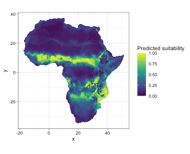
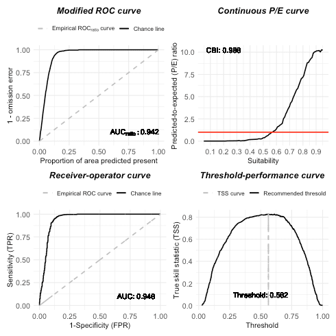
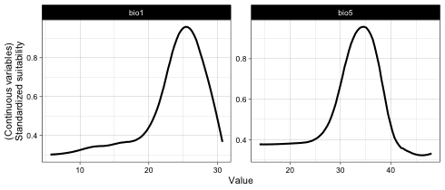
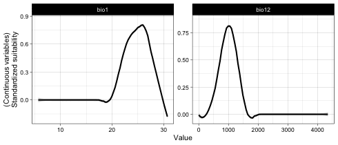
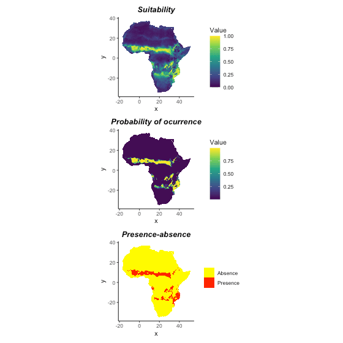
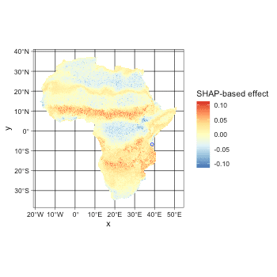

## Set up

```r
library(sf, quietly = T)
library(itsdm, quietly = T)
library(ggplot2, quietly = T)
library(dplyr, quietly = T)
select <- dplyr::select
```

## Prepare environmental variables

We could use packages like `rnaturalearth` to quickly get the boundary of most countries
and regions. You can also read your study area boundary for sure. Providing
your boundary to function `worldclim2` would allow you to download files from worldclim
version 2 clipping to your area.


```r
library(stars, quietly = T)
library(rnaturalearth, quietly = T)

# Get Africa continent
af <- ne_countries(
  continent = 'africa', returnclass = 'sf') %>%
  filter(admin != 'Madagascar') # remove Madagascar

# Union countries to continent
af_bry <- st_buffer(af, 0.1) %>%
  st_union() %>%
  st_as_sf() %>%
  rename(geometry = x) %>%
  st_make_valid()

bios <- worldclim2(var = 'bio', bry = af_bry,
                   path = tempdir(),
                   nm_mark = 'africa')

# Plot BIO1 to check the variables
# plot(bios %>% slice('band', 1),
#      main = st_get_dimension_values(bios, 'band')[1])
```

In species modeling, people usually want to remove the strong correlations between
environmental variables. `dim_reduce` is just a function you need. The function
could either reduce the dimension of your environmental variable stack itself or according
to a bunch of observations. It also allows you to set a desirable threshold. Note that it only
works on numeric variables. Because categorical variables have less risk of having a high correlation with others, we usually prefer to keep categorical variables.


```r
library(stars, quietly = T)
# An example of reducing dimensions
## Here we didn't set samples, so use whole image
bios_reduce <- dim_reduce(
  bios, threshold = 0.6,
  preferred_vars = c('bio1', 'bio12', 'bio5'))

# Returned ReducedImageStack object
bios_reduce
#> Dimension reduction
#> Correlation threshold: 0.6
#> Original variables: bio1, bio2, bio3, bio4, bio5, bio6, bio7, bio8, bio9,
#> bio10, bio11, bio12, bio13, bio14, bio15, bio16, bio17, bio18, bio19
#> Variables after dimension reduction: bio1, bio12, bio9, bio14, bio15
#> ================================================================================
#> Reduced correlations:
#>        bio1 bio12  bio9 bio14 bio15
#> bio1   1.00 -0.04  0.50 -0.07  0.44
#> bio12 -0.04  1.00 -0.03  0.56 -0.16
#> bio9   0.50 -0.03  1.00  0.01 -0.06
#> bio14 -0.07  0.56  0.01  1.00 -0.40
#> bio15  0.44 -0.16 -0.06 -0.40  1.00

# img_reduced of ReducedImageStack is the raster stack
bios_reduce$img_reduced
#> stars object with 3 dimensions and 1 attribute
#> attribute(s):
#>                Min.  1st Qu.   Median     Mean  3rd Qu. Max.   NA's
#> reduced_image     0 17.75392 25.91388 154.5419 83.09974 4347 447385
#> dimension(s):
#>      from   to offset     delta refsys point         values x/y
#> x     975 1388   -180  0.166667 WGS 84 FALSE           NULL [x]
#> y     316  750     90 -0.166667 WGS 84 FALSE           NULL [y]
#> band    1    5     NA        NA     NA    NA bio1,...,bio15
```

## Creating the virtual species

Using virtual species is a crucial method in ecological studies. First, let's create a virtual species using the package `virtualspecies` to know exactly what is happening.


```r
library(here, quietly = T)
library(virtualspecies, quietly = T)

# Subset environmental variables to use
bios_sub <- bios %>% slice('band', c(1, 5, 12, 15))
bios_sub <- stack(as(split(bios_sub), 'Spatial'))

# Formatting of the response functions
set.seed(10)
my.parameters <- formatFunctions(
  bio1 = c(fun = 'dnorm', mean = 25, sd = 5),
  bio5 = c(fun = 'dnorm', mean = 35, sd = 5),
  bio12 = c(fun = 'dnorm', mean = 1000, sd = 500),
  bio15 = c(fun = 'dnorm', mean = 100, sd = 50))

# Generation of the virtual species
set.seed(10)
my.species <- generateSpFromFun(
  raster.stack = bios_sub,
  parameters = my.parameters,
  plot = F)

# Conversion to presence-absence
set.seed(10)
my.species <- convertToPA(
  my.species,
  beta = 0.7,
  plot = F)

# Plot maps
plot(my.species)
```


```r
# And response curves
plotResponse(my.species)
```


## Generate pseudo samples for virtual species


```r
# Sampling
set.seed(10)
po.points <- sampleOccurrences(
  my.species,
  n = 2000,
  type = "presence only",
  plot = FALSE)
po_df <- po.points$sample.points %>%
  select(x, y) %>%
  mutate(id = row_number())
head(po_df)
#>           x          y id
#> 1 -6.083333  11.083333  1
#> 2 -5.750000  10.250000  2
#> 3 38.750000  -6.750000  3
#> 4 39.250000 -10.416667  4
#> 5 26.583333  -8.583333  5
#> 6  0.250000   9.083333  6
```

As we all know, there are commonly sampling bias and observation errors. People use multiple methods to reduce these disturbances in samples. For example, here, we use the function `suspicious_env_outliers` to detect and/or remove possible environmental outliers. This step could be used with other strategies to do sample cleaning.


```r
# Get environmental variable stack
## Here we added BIO6 and BIO13 as extra variables
variables <- bios %>% slice('band', c(1, 5, 6, 12, 13, 15))

# Check outliers
occ_outliers <- suspicious_env_outliers(
  po_df,
  variables = variables,
  z_outlier = 5,
  outliers_print = 4L)
#> Reporting top 4 outliers [out of 15 found]
#> 
#> row [73] - suspicious column: [bio15] - suspicious value: [75.37]
#> 	distribution: 99.500% >= 91.64 - [mean: 109.35] - [sd: 7.75] - [norm. obs: 199]
#> 	given:
#> 		[bio6] <= [17.76] (value: 17.58)
#> 		[bio1] > [26.52] (value: 26.60)
#> 
#> 
#> row [292] - suspicious column: [bio13] - suspicious value: [372.00]
#> 	distribution: 99.448% <= 322.00 - [mean: 246.07] - [sd: 21.90] - [norm. obs: 180]
#> 	given:
#> 		[bio12] > [929.00] (value: 1208.00)
#> 		[bio15] > [95.94] (value: 97.00)
#> 		[bio6] > [16.56] (value: 22.46)
#> 
#> 
#> row [301] - suspicious column: [bio6] - suspicious value: [19.83]
#> 	distribution: 99.259% <= 17.04 - [mean: 15.06] - [sd: 0.85] - [norm. obs: 134]
#> 	given:
#> 		[bio1] between (24.49, 25.95] (value: 25.10)
#> 		[bio13] > [262.00] (value: 271.00)
#> 
#> 
#> row [326] - suspicious column: [bio15] - suspicious value: [150.14]
#> 	distribution: 99.702% <= 116.78 - [mean: 91.55] - [sd: 11.41] - [norm. obs: 335]
#> 	given:
#> 		[bio6] <= [17.76] (value: 16.52)
#> 		[bio12] > [1140.00] (value: 1190.00)
#> 		[bio5] <= [36.43] (value: 34.96)

# Check result
# You could also plot samples overlap with a raster
# plot(occ_outliers,
#      overlay_raster = variables %>% slice('band', 6))
plot(occ_outliers)
```


```r

# Remove outliers if necessary
occ_outliers <- suspicious_env_outliers(
  po_df, variables = variables,
  rm_outliers = T,
  z_outlier = 5,
  outliers_print = 0L)
po_sf <- occ_outliers$pts_occ

# Make occurrences
set.seed(11)
occ_sf <- po_sf %>% sample_frac(0.7)
occ_test_sf <- po_sf %>% filter(! id %in% occ_sf$id)
occ_sf <- occ_sf %>% select(-id)
occ_test_sf <- occ_test_sf %>% select(-id)

# Have a look at the samples if you like
# ggplot() +
#   geom_raster(data = as.data.frame(my.species$suitab.raster, xy = T),
#               aes(x, y, fill = layer)) +
#   scale_fill_viridis_c('Suitability', na.value = 'transparent') +
#   geom_sf(data = occ_sf, aes(color = 'Train'), size = 0.8) +
#   geom_sf(data = occ_test_sf, aes(color = 'Test'), size = 0.8) +
#   scale_color_manual('', values = c('Train' = 'red', 'Test' = 'blue')) +
#   theme_classic()
```

## Build a simple `isolation_forest` species distribution model

Here we build a SDM using extended isolation forest (with `ndim = 2`).


```r
# Do modeling
it_sdm <- isotree_po(occ = occ_sf,
                     occ_test = occ_test_sf,
                     variables = variables,
                     sample_rate = 0.8,
                     ndim = 2)
```

Let's compare the predicted suitability with real suitability.




Let's do model evaluation using multiple presence-only metrics. In this package, we implement both presence-only and presence-background evaluation metrics. The model calculated evaluation on both training and test datasets. Here we just display evaluation on test dataset. You could check `it_sdm$eval_train` the same way as `it_sdm$eval_test`.


```r
# Metrics based on test dataset
it_sdm$eval_test
#> ===================================
#> Presence-only evaluation:
#> CVI with 0.25 threshold:      0.729
#> CVI with 0.5 threshold:       0.808
#> CVI with 0.75 threshold:      0.626
#> CBI:                          0.995
#> AUC (ratio)                   0.943
#> ===================================
#> Presence-background evaluation:
#> Sensitivity:                  0.961
#> Specificity:                  0.862
#> TSS:                          0.824
#> AUC:                          0.950
#> Similarity indices:
#> Jaccard's similarity index:   0.845
#> Sørensen's similarity index:  0.916
#> Overprediction rate:          0.125
#> Underprediction rate:         0.039
plot(it_sdm$eval_test)
```



The result of `isotree_po` has options to generate response curves and variable analysis together. The response curves include marginal response curves, independent response curves, and variable dependence made by SHAP. The variable analysis consists of the Jackknife of Pearson correlation with the result of the full model with all variables and AUC_ratio and variable dependence with SHAP test.


```r
# Plot response curves
## Marginal response curves of all variables
plot(it_sdm$marginal_responses)
```




```r
## Independent response curves of variable bio1 and bio12.
plot(it_sdm$independent_responses, target_var = c('bio1', 'bio12'))
```




```r
## Variable dependence scatter points with fitted curves made by SHAP test
plot(it_sdm$variable_dependence)
```


```r
# Printing variable analysis could give you enough info of variable importance
it_sdm$variable_analysis
#> Relative variable importance
#> ===================================
#> Methods: Jackknife test and SHAP
#> Numer of variables: 6
#> ===================================
#> Jackknife test
#> Based on Pearson correlation (Max value is 1)
#> [Training dataset]:
#> bio12 With only: ######################## 0.539
#>       Without  : ########################################## 0.934
#> bio13 With only: ####################### 0.513
#>       Without  : ########################################## 0.938
#> bio6  With only: ###################### 0.478
#>       Without  : ########################################## 0.931
#> bio1  With only: ################### 0.433
#>       Without  : ########################################### 0.95
#> bio15 With only: ################ 0.359
#>       Without  : ########################################## 0.929
#> bio5  With only: ########### 0.241
#>       Without  : ########################################## 0.94
#> [Test dataset]:
#> bio12 With only: ######################## 0.533
#>       Without  : ########################################## 0.932
#> bio13 With only: ######################## 0.527
#>       Without  : ######################################### 0.92
#> bio6  With only: ##################### 0.463
#>       Without  : ########################################## 0.924
#> bio1  With only: ################ 0.36
#>       Without  : ########################################### 0.948
#> bio15 With only: ################ 0.356
#>       Without  : ########################################## 0.928
#> bio5  With only: ######### 0.208
#>       Without  : ########################################## 0.939
#> ======================================================================
#> Jackknife test
#> Based on AUC ratio (Max value of traing and test are 0.944 and 0.944)
#> [Training dataset]:
#> bio12 With only: ######################################## 0.894
#>       Without  : ########################################## 0.942
#> bio13 With only: ##################################### 0.822
#>       Without  : ########################################## 0.944
#> bio5  With only: ##################################### 0.82
#>       Without  : ########################################## 0.94
#> bio15 With only: #################################### 0.799
#>       Without  : ########################################## 0.941
#> bio6  With only: ################################## 0.761
#>       Without  : ########################################### 0.946
#> bio1  With only: ################################## 0.752
#>       Without  : ########################################## 0.942
#> [Test dataset]:
#> bio12 With only: ######################################## 0.886
#>       Without  : ########################################## 0.941
#> bio13 With only: #################################### 0.802
#>       Without  : ########################################## 0.944
#> bio5  With only: #################################### 0.794
#>       Without  : ########################################## 0.939
#> bio15 With only: ################################### 0.77
#>       Without  : ########################################## 0.942
#> bio6  With only: ################################# 0.744
#>       Without  : ########################################### 0.945
#> bio1  With only: ################################# 0.732
#>       Without  : ########################################## 0.941
#> ======================================================================
#> SHAP (mean(|Shapley value|))
#> [Training dataset]:
#> bio12 : ############################################# 0.073
#> bio15 : ######################################### 0.066
#> bio1  : ####################################### 0.062
#> bio6  : ###################################### 0.062
#> bio13 : ###################################### 0.061
#> bio5  : #################################### 0.058
#> [Test dataset]:
#> bio12 : ############################################# 0.073
#> bio15 : ########################################### 0.069
#> bio1  : ######################################## 0.065
#> bio6  : ####################################### 0.063
#> bio13 : ####################################### 0.062
#> bio5  : #################################### 0.057

# We also could plot variable importance out
plot(it_sdm$variable_analysis)
```


The direct result of function `isotree_po` is environmental suitability. We could use function `convert_to_pa` to convert suitability to presence-absence based on different methods: threshold, logistic, and linear conversion, and/or a desirable species prevalence.


```r
# An example of converting to presence-absence map
## Use logistic conversion with alpha = -0.05, beta = 0.5
## and not set species prevalence
pa_map <- convert_to_pa(it_sdm$prediction,
                        method = "logistic",
                        beta = 0.5,
                        alpha = -.05)
pa_map; plot(pa_map)
#> Logistic conversion
#> beta = 0.5
#> alpha = -0.05
#> species prevalence = 0.15696423250527
```



## Analyze vairable dependence

It is always helpful to understand the dependence among variables. The result of function `variable_dependence` or `it_sdm$variable_dependence` can be used to analyze variable dependence.


```r
var_dependence <- variable_dependence(
  it_sdm$model,
  it_sdm$var_train %>% st_drop_geometry())

# Multiple ways to plot variable VariableDependence object
## Plot without smooth fit curve
plot(var_dependence,
     target_var = c('bio1', 'bio12'),
     related_var = 'bio13', smooth_span = 0)
```


## Analyze variable contribution

Sometimes, we are interested in some observations, for instance, the outliers. `variable_dependence` is such function that allows you to analyze the contribution of each variable. It relies on Shapley value.


```r
## Analyze variable contribution for interested observations.
## For example, outliers.
var_contrib <- variable_contrib(
  it_sdm$model,
  it_sdm$var_train %>% st_drop_geometry(),
  it_sdm$var_test %>% st_drop_geometry() %>% slice(1:6))

# Plot contribution separately for each observation
## By default, it only plot the most 5 important variables for each observation
## You could change `num_features` to show more variables
plot(var_contrib, plot_each_obs = T)
```


```r
# Plot general contribution for all observations
plot(var_contrib)
```


