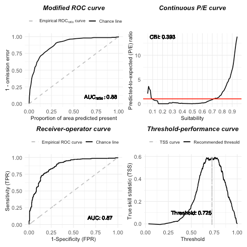
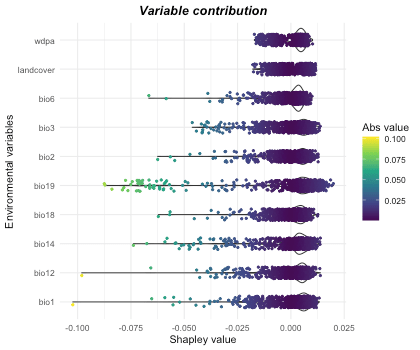
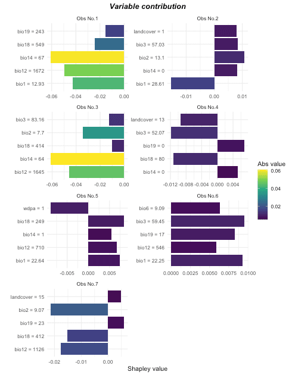

## Set up

Install your missing packages


```r
install.packages("rnaturalearth")
install.packages("rgbif")
install.packages("lubridate")
options(repos = c(
  ropensci = 'https://ropensci.r-universe.dev',
  CRAN = 'https://cloud.r-project.org'))
install.packages('scrubr')
```


```r
library(itsdm, quietly = T)
library(ggplot2, quietly = T)
library(dplyr, quietly = T)
select <- dplyr::select
```

## Prepare environmental variables

The objective of this vignette is to provide an example of how to use categorical variables in `itsdm` and show a reasonable workflow of SDM, not to create an optimal model.

Before building a formal good model, we should try something as a start. Here we use the variables listed below to create a primary model.

1. Bioclimatic variables
2. Protected area and land cover type as categorical variables.

Note that maps of the protected area and land cover types are prepared and provided in this package. You could use `system.file` with file names to find them like the following.


```r
library(stars)
library(rnaturalearth, quietly = T)

# Bioclimatic variables
data("mainland_africa")
bios <- worldclim2(var = 'bio',
                   bry = mainland_africa,
                   path = tempdir(),
                   nm_mark = 'africa') %>%
  st_normalize()

# Protected area
fname <- 'extdata/wdpa_africa_10min.tif'
wdpa <- system.file(fname, package = 'itsdm') %>%
  read_stars() %>% setNames('wdpa')

# Land cover
fname <- 'extdata/landcover_africa_10min.tif'
landcover <- system.file(fname, package = 'itsdm') %>%
  read_stars() %>% setNames('landcover')

# Merge them together as variable stack
variables <- do.call(c, list(split(bios, 'band'),
                             wdpa, landcover))
rm(fname, bios, wdpa, landcover)
```

## Prepare occurrence from GBIF

The official name for the African savanna elephant is Loxodonta africana (Blumenbach, 1797), which could be used to search in GBIF. According to the following reasons:

1. It is not reasonable to use the very past data.
2. The distribution of elephants is relatively stable over a short time.

We choose the most recent occurrence observations (2010 to now) with an assumption that landcover changes could be ignorable between 2010 and now.


```r
library(lubridate, quietly = T)
library(rgbif, quietly = T)

## Set the time interval for querying on GBIF
start_year <- 2010
year <- sprintf('%s,%s',  start_year, year(Sys.Date()))

# Search
nm_search <- "Loxodonta africana (Blumenbach, 1797)"
occ <- occ_search(scientificName = nm_search,
                  hasCoordinate = TRUE,
                  limit = 200000,
                  year = year,
                  hasGeospatialIssue = FALSE)
```

Even though the occurrence dataset obtained from GBIF has high quality and its API provides available options to do some screening. There are still some disturbances contained in occurrence. As a complement, we do extra steps to clean the occurrence data. The steps include:

1. Basic Geo-cleaning. For example, clean the records with impossible or incomplete coordinates. Or clean the duplicated records. We did this step using package `scrubr`.
2. Range-cleaning. Strict the records to a specific area, which is an extra step for Geo-cleaning.
3. Spatial deduction. This step is to remove duplicates at the spatial resolution of raster.
4. __Environmental cleaning__. Detect and/or drop the records with outlier environmental values. We could do this step before dimension reduction of the environmental variable because `outlier.tree` compares records with the general condition.


```r
library(scrubr, quietly = T)

# Step1: Basic Geo-cleaning on occurrence
occ_clean <- occ$data %>%
  select(name, decimalLongitude,
         decimalLatitude, eventDate, key) %>%
  setNames(c('name', 'longitude',
             'latitude', 'date', 'key')) %>%
  mutate(date = as.Date(date)) %>%
  dframe() %>%
  coord_impossible() %>%
  coord_incomplete() %>%
  coord_unlikely()

# Step2: Range-cleaning on occurrence
## For example, Africa savanna elephant only could appear in Africa
data("mainland_africa")
occ_clean_sf <- occ_clean %>%
  st_as_sf(coords = c('longitude', 'latitude'),
           crs = 4326)
occ_clean_sf <- st_intersection(mainland_africa, occ_clean_sf)

# Step3: Spatial deduction
occ_clean_sf <- st_rasterize(
  occ_clean_sf,
  template = variables %>% select('bio1') %>%
    mutate(bio1 = NA)) %>%
  st_xy2sfc(as_points = T) %>% st_as_sf() %>%
  select(geometry)
```


```r
# Step4: Environmental-cleaning on occurrence
## We used a very high z_outliers
## It is tricky to remove environmental outliers
## because it is hard to tell if they are outliers or
## just rare records.
occ_outliers <- suspicious_env_outliers(
  occ_clean_sf,
  variables = variables,
  z_outlier = 16,
  outliers_print = 4L)
#> Reporting top 4 outliers [out of 27 found]
#> 
#> row [123] - suspicious column: [bio14] - suspicious value: [1.00]
#> 	distribution: 98.701% <= 0.00 - [mean: 0.00] - [sd: 0.00] - [norm. obs: 76]
#> 	given:
#> 		[bio11] > [25.71] (value: 26.22)
#> 
#> 
#> row [1] - suspicious column: [bio17] - suspicious value: [1.00]
#> 	distribution: 96.000% <= 0.00 - [mean: 0.00] - [sd: 0.00] - [norm. obs: 24]
#> 	given:
#> 		[bio14] <= [1.00] (value: 0.00)
#> 		[bio5] > [39.79] (value: 41.24)
#> 
#> 
#> row [521] - suspicious column: [bio19] - suspicious value: [36.00]
#> 	distribution: 97.297% >= 509.00 - [mean: 616.06] - [sd: 40.46] - [norm. obs: 36]
#> 	given:
#> 		[bio17] > [2.00] (value: 27.00)
#> 		[bio5] > [35.53] (value: 36.72)
#> 
#> 
#> row [801] - suspicious column: [bio19] - suspicious value: [1.00]
#> 	distribution: 96.429% <= 0.00 - [mean: 0.00] - [sd: 0.00] - [norm. obs: 27]
#> 	given:
#> 		[bio13] <= [65.00] (value: 45.00)
#> 		[bio17] <= [2.00] (value: 0.00)
plot(occ_outliers)
```


According to the figure and the prior knowledge of the Africa savanna elephant, we decide not to drop the outliers. The outliers seem more like rare records. In addition, if they are real outliers, the later `isolation.forest` could detect them again. Now let's organize the occurrence before the next step.


```r
occ <- occ_outliers$pts_occ
rm(occ_clean_sf)
```

## Understand the correlations between variables

Function `dim_reduce` in this package allows the user to reduce the dimensions arbitrarily for numeric environmental variables based on their correlation. Thus, here we do such thing to numeric ones of `variables` and keep the categorical ones.


```r
# Split continuous and categorical variables
# and reduce dimensions for continuous ones
cat_vars <- c('wdpa', 'landcover')
var_cat <- variables %>% select(all_of(cat_vars))
var_con <- variables %>% select(-all_of(cat_vars))
var_con_rdc <- dim_reduce(var_con, threshold = 0.75, samples = occ)
var_con_rdc
#> Dimension reduction
#> Correlation threshold: 0.75
#> Original variables: bio1, bio2, bio3, bio4, bio5, bio6, bio7, bio8, bio9,
#> bio10, bio11, bio12, bio13, bio14, bio15, bio16, bio17, bio18, bio19
#> Variables after dimension reduction: bio1, bio2, bio3, bio6, bio12, bio14,
#> bio18, bio19
#> ================================================================================
#> Reduced correlations:
#>        bio1  bio2  bio3  bio6 bio12 bio14 bio18 bio19
#> bio1   1.00  0.02 -0.22  0.64  0.06 -0.39 -0.41  0.29
#> bio2   0.02  1.00 -0.43 -0.66 -0.55 -0.46 -0.34 -0.29
#> bio3  -0.22 -0.43  1.00  0.43  0.33  0.44  0.23  0.22
#> bio6   0.64 -0.66  0.43  1.00  0.46  0.11 -0.09  0.48
#> bio12  0.06 -0.55  0.33  0.46  1.00  0.59  0.49  0.54
#> bio14 -0.39 -0.46  0.44  0.11  0.59  1.00  0.43  0.30
#> bio18 -0.41 -0.34  0.23 -0.09  0.49  0.43  1.00 -0.07
#> bio19  0.29 -0.29  0.22  0.48  0.54  0.30 -0.07  1.00

# Put together
var_con <- var_con_rdc$img_reduced
variables <- do.call(c, list(split(var_con, 'band'), var_cat))
rm(cat_vars, var_cat, var_con, var_con_rdc)
```

It is highly not recommended to merge `attributes` of `variables` to `band ` or any other dimension if there are any categorical layers in it unless you know pretty well about what you are doing. Because merging will force categorical values to change to numeric ones, you know that it is tricky to convert between factors and numbers in R.


```r
# If you really want to merge
## At least could ensure the values are the original values
var_merge <- variables
var_merge <- var_merge %>%
  mutate(wdpa = as.integer(levels(wdpa))[wdpa],
         landcover = as.integer(levels(landcover))[landcover])
var_merge <- merge(var_merge, name = 'band')
rm(var_merge)
```

By far, the `variables` is the environmental variable stack with numeric ones with low correlation and categorical ones.

## Split occurrence to training and test


```r
# Make occurrences
occ <- occ %>% mutate(id = 1:nrow(.))
set.seed(11)
occ_sf <- occ %>% sample_frac(0.7)
occ_test_sf <- occ %>% filter(! id %in% occ_sf$id)
occ_sf <- occ_sf %>% select(-id)
occ_test_sf <- occ_test_sf %>% select(-id)
rm(occ)
```

Now both occurrence and environmental variables are ready to use for modeling.

## Build a `isolation_forest` species distribution model

At this step, the users could use strategies like grid search and preferred evaluation metrics to find the optimal arguments for the model. As an example, here we use a set of arguments:

- `ntrees = 200`
- `sample_rate = 0.9`
- `ndim = 4` because we includes 2 categorical variables
- `categ_cols = c('wdpa', 'landcover')`


```r
# Do modeling
it_sdm <- isotree_po(occ = occ_sf,
                     occ_test = occ_test_sf,
                     variables = variables,
                     categ_vars = c('wdpa', 'landcover'),
                     ntrees = 200L,
                     sample_size = 0.9,
                     ndim = 4,
                     seed = 10L)
```

## Visualize results

Predicted environmental suitability


This indicates African savanna elephants have a very large potential habitat on this continent. Like more explicit field research indicates that the potential range of African elephants could be more than five times larger than its current extent (https://scitechdaily.com/african-elephants-have-plenty-of-habitat-if-spared-from-the-ivory-trade/). As a mega-mammal, elephants could adapt themselves to survive harsh environments.

Presence-only model evaluation


```r
# According to training dataset
# it_sdm$eval_train
# plot(it_sdm$eval_train)

# According to test dataset
it_sdm$eval_test
#> ===================================
#> Presence-only evaluation:
#> CVI with 0.25 threshold:      0.007
#> CVI with 0.5 threshold:       0.102
#> CVI with 0.75 threshold:      0.548
#> CBI:                          0.586
#> AUC (ratio)                   0.864
#> ===================================
#> Presence-background evaluation:
#> Sensitivity:                  0.740
#> Specificity:                  0.813
#> TSS:                          0.553
#> AUC:                          0.849
#> Similarity indices:
#> Jaccard's similarity index:   0.623
#> Sørensen's similarity index:  0.767
#> Overprediction rate:          0.203
#> Underprediction rate:         0.260
plot(it_sdm$eval_test)
```



According to the evaluation, the model has the potential to improve, for instance, by adding more explanatory features: forest cover, distance to water, elevation, slope, human influence, etc. According to the continuous Boyce index and TSS curve, the model overestimates some "completely" unsuitable areas, for example, Sahara (see above suitability map). One assumption is that several occurrence data locate in the Namib desert. And land cover map reflects this information to Sahara. But Namib desert is very narrow and close to natural resources, which makes it suitable for elephants. However, deep Sahara is not the same story. So, including a feature describing the distance to water could be helpful to improve the model.

## Response curves

Response curves of environmental variables show how the suitability of a variable to this species changes when its value is varied.

Marginal response curves


```r
# Plot response curves
plot(it_sdm$marginal_responses, target_var = c('bio1', 'bio12'))
```


We checked the marginal response curves of two bioclimatic variables. The response curve of bio1 and bio12 are very reasonable and indicate the preferred temperature and precipitation conditions.

Independent response curves


```r
plot(it_sdm$independent_responses, target_var = c('landcover', 'wdpa'))
```


According to the figure above, elephants go beyond protected areas often. This matches with the previous study related to elephant movement. Thus, the binary protected area is not a good modeling variable. Distance to the protected area might be, however. Because usually, there are plenty of natural resources (food, water, etc.) within the protected area. Elephants might like to stay around these protected areas.
The response of land cover indicates that elephants strongly prefer to stay in some landscape, such as forest, shrub, wetland, cropland, and built-up. Here is some useful information:

1. Forest/shrub cover ratio may be another helpful feature regarding land cover.
2. Distance to human residential (e.g., village) may be helpful.

Shapley value based dependence curves


```r
## Variable dependence scatter points with fitted curves made by SHAP test
plot(it_sdm$shap_dependences, smooth_span = 0)
```


Now, let's overview all variable responses made by Shapley values. All variables seem to be the environmental features of elephants. Precipitation seems like a solid decisive factor. We could analyze feature importance further to diagnose the contribution of each variable.

## Variable importance

Variable importance analysis is another way to understand the relationship between environmental variables and species distribution. It also could help to improve model performance.


```r
it_sdm$variable_analysis
#> Relative variable importance
#> ===================================
#> Methods: Jackknife test and SHAP
#> Numer of variables: 10
#> ===================================
#> Jackknife test
#> Based on Pearson correlation (Max value is 1)
#> [Training dataset]:
#> bio12     With only: ################################## 0.757
#>           Without  : ############################################ 0.976
#> bio18     With only: ############################ 0.616
#>           Without  : ############################################ 0.982
#> landcover With only: ########################### 0.603
#>           Without  : ############################################ 0.987
#> bio3      With only: ########################### 0.594
#>           Without  : ############################################ 0.979
#> bio6      With only: ######################## 0.537
#>           Without  : ############################################ 0.986
#> bio19     With only: ######################## 0.531
#>           Without  : ########################################### 0.957
#> bio1      With only: ##################### 0.463
#>           Without  : ############################################ 0.985
#> wdpa      With only: #################### 0.434
#>           Without  : ############################################ 0.985
#> bio14     With only: ################ 0.365
#>           Without  : ############################################ 0.984
#> bio2      With only: ############### 0.333
#>           Without  : ############################################ 0.987
#> [Test dataset]:
#> bio12     With only: ################################# 0.742
#>           Without  : ############################################ 0.971
#> landcover With only: ########################## 0.581
#>           Without  : ############################################ 0.987
#> bio19     With only: ########################## 0.571
#>           Without  : ########################################### 0.952
#> bio3      With only: ########################## 0.569
#>           Without  : ############################################ 0.979
#> bio18     With only: ######################## 0.542
#>           Without  : ############################################ 0.985
#> bio6      With only: ###################### 0.485
#>           Without  : ############################################ 0.986
#> wdpa      With only: #################### 0.453
#>           Without  : ############################################ 0.984
#> bio1      With only: ################## 0.405
#>           Without  : ############################################ 0.984
#> bio14     With only: ################ 0.364
#>           Without  : ############################################ 0.984
#> bio2      With only: ############# 0.297
#>           Without  : ############################################ 0.986
#> ======================================================================
#> Jackknife test
#> Based on AUC ratio (Max value of traing and test are 0.877 and 0.864)
#> [Training dataset]:
#> bio12     With only: ###################################### 0.843
#>           Without  : ###################################### 0.853
#> bio18     With only: #################################### 0.802
#>           Without  : ####################################### 0.877
#> bio3      With only: ################################## 0.762
#>           Without  : ######################################## 0.886
#> bio6      With only: ################################ 0.716
#>           Without  : ####################################### 0.874
#> bio1      With only: ################################ 0.707
#>           Without  : ####################################### 0.875
#> landcover With only: ############################### 0.678
#>           Without  : ######################################## 0.882
#> wdpa      With only: ############################## 0.678
#>           Without  : ####################################### 0.87
#> bio2      With only: ############################## 0.661
#>           Without  : ####################################### 0.871
#> bio19     With only: ######################## 0.53
#>           Without  : ######################################## 0.886
#> bio14     With only: ############## 0.306
#>           Without  : ######################################## 0.89
#> [Test dataset]:
#> bio12     With only: ##################################### 0.82
#>           Without  : ###################################### 0.844
#> bio18     With only: ################################### 0.767
#>           Without  : ####################################### 0.866
#> bio3      With only: ################################# 0.737
#>           Without  : ######################################## 0.881
#> landcover With only: ############################### 0.691
#>           Without  : ####################################### 0.872
#> bio6      With only: ############################### 0.686
#>           Without  : ####################################### 0.868
#> bio1      With only: ############################## 0.673
#>           Without  : ####################################### 0.868
#> wdpa      With only: ############################## 0.669
#>           Without  : ####################################### 0.863
#> bio2      With only: ########################## 0.588
#>           Without  : ####################################### 0.87
#> bio19     With only: ####################### 0.521
#>           Without  : ####################################### 0.875
#> bio14     With only: ############## 0.309
#>           Without  : ######################################## 0.881
#> ======================================================================
#> SHAP (mean(|Shapley value|))
#> [Training dataset]:
#> bio12     : ########################################### 0.016
#> bio19     : ####################################### 0.015
#> bio3      : ############################### 0.012
#> bio18     : ########################## 0.01
#> bio1      : ######################## 0.009
#> bio14     : ################### 0.007
#> bio6      : ################## 0.007
#> bio2      : ################## 0.007
#> landcover : ################ 0.006
#> wdpa      : ############### 0.006
#> [Test dataset]:
#> bio12     : ############################################# 0.017
#> bio19     : ######################################### 0.015
#> bio3      : ############################### 0.012
#> bio18     : ######################## 0.009
#> bio1      : ####################### 0.009
#> bio14     : ################### 0.007
#> bio6      : ################## 0.007
#> bio2      : ################## 0.007
#> landcover : ################ 0.006
#> wdpa      : ################ 0.006
```

From the text above, annual precipitation is the most important decisive factor. Because precipitation decides the supply of food and water. Temperature is not a very critical constraint to elephants. It indicates that compared to food/water, elephants could tolerate the extreme temperature. Bio14 (Precipitation of Driest Month) is a not-important variable agreed by the Jackknife test and SHAP test. One assumption is that all animals must deal with limited precipitation over the driest month, common in the African savanna. In the Jackknife test, landcover has a relatively high contribution when working alone. But the model performs very well without it. The same to wdpa. In the Shapley value-based test, these two variables are judged as less important. It indicates that landcover and wdpa strongly correlate with some other variables. Changing the way to use them might be necessary to improve the model performance.

Shapley value summary plot is another way to interpret variable contribution.


```r
var_contrib <- variable_contrib(
  it_sdm$model,
  it_sdm$var_train %>% st_drop_geometry(),
  it_sdm$var_train %>% st_drop_geometry())
# Plot general contribution for all observations
plot(var_contrib)
```



## Presence-absence map

Use function `convert_to_pa` to convert suitability to probability of occurrence.


```r
# Convert to presence-absence map
pa_map <- convert_to_pa(it_sdm$prediction,
                        method = "logistic",
                        beta = 0.2,
                        species_prevalence = 0.2,
                        threshold = 0.5)
ggplot() +
  geom_stars(data = pa_map$probability_of_occurrence) +
  scale_fill_viridis_c('Probability of occurrence',
                       na.value = 'transparent') +
  coord_equal() +
  theme_linedraw()
```


## Analyze variable dependence

Randomly check variable dependence with each other.


```r
plot(it_sdm$shap_dependences,
     target_var = c('bio1', 'bio12', 'landcover'),
     related_var = 'bio3', smooth_span = 0)
```


Bio3 has a strong correlation with bio12. We could check variable dependence one by one to exclude some in the final model.

## Analyze variable contribution

Sometimes, we are interested in some observations, for instance, the outliers detected in the beginning steps. According to the figure below, we can tell that these suspicious outliers are not all environmental outliers.


```r
## Analyze variable contribution for interested observations.
## For example, the first 10 outliers detected.
var_occ <- it_sdm$var_train %>% st_drop_geometry()
var_analysis <- var_occ %>%
  slice(occ_outliers$outliers %>% 
          arrange(-outlier_score) %>% 
          slice(1:10) %>% 
          pull(suspious_row))
var_contrib_outliers <- variable_contrib(
  it_sdm$model,
  var_occ,
  var_analysis)

# Plot contribution separately for each observation
## By default, it only plot the most 5 important variables for each observation
## You could change `num_features` to show more variables
plot(var_contrib_outliers, plot_each_obs = T)
```



According to feature response curves and this figure, some detected outliers could be removed from training. For example, some features have a strongly negative contribution to observations No.2, No.4, and No.6 and they could be excluded.

## Conclusion

With a primary analysis, we found a few obvious things to do to improve model performance:

1. Add more explanatory features, such as vegetation, distance to water, elevation, slope, human influence (e.g., distance to human residential, population density, and distance to roads), etc.
2. Since precipitation is more important than others to determine where elephants go. Add more bioclimatic variables related to rainfall.
2. Change the way of using land cover categorical map and protected area binary map. Use ratio or distance instead.
3. Delete some outliers from the occurrence dataset.
4. Probably tune one or two parameters in `isotree_po`. When the distribution of elephants is well studied, the model only translate the information to machine language. A good model can explain clearly and concisely but cannot tell you the knowledge that it is not taught.

The interested user could try it on their own.

