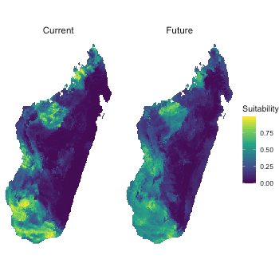
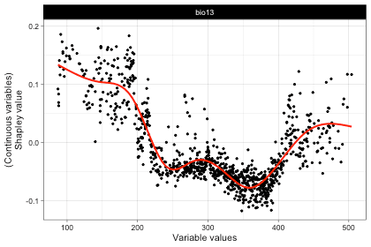
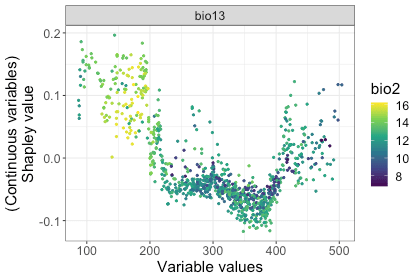
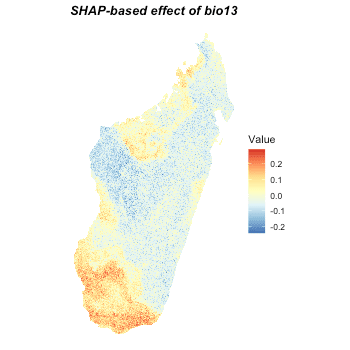
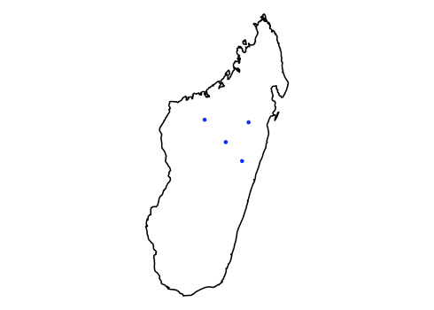
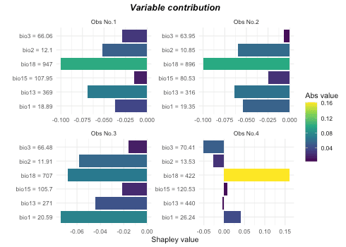
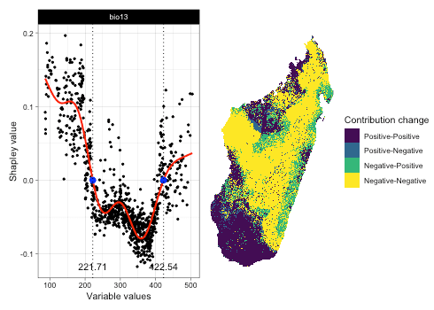

## Introduction

In `itsdm`, Shapley values-based functions can be used both by internal model iForest and external models which is fitted outside of `itsdm`. These functions can analyze spatial and non-spatial variable responses, contributions of environmental variables to any observations or predictions, and potential areas that will be affected by changing variables.

In this vignette, we show how an external model can be used for these functions with an example of Random forest (RF) model on Baobab trees of Madagascar.

## Load libraries


```r
# Load libraries
library(itsdm)
library(dplyr)
library(stars)
library(virtualspecies)
library(dismo)
library(randomForest)
library(ggplot2)
library(ggpubr)
library(rnaturalearth)
library(rgbif)
library(lubridate)
select <- dplyr::select
```

## Baobab trees of Madagascar


```r
# Set study area, Madagascar
study_area <- ne_countries(
  scale = 10,
  continent = 'africa', returnclass = 'sf') %>%
  filter(admin == 'Madagascar') %>%
  select()

# Get training data
## Search via GBIF
occ <- occ_search(
  scientificName = "Adansonia za Baill.",
  hasCoordinate = TRUE,
  limit = 200000,
  hasGeospatialIssue = FALSE) %>%
  `[[`("data") %>%
  select(decimalLongitude, decimalLatitude)

## Clean the occurrences spatially
occ <- occ %>%
  st_as_sf(coords = c('decimalLongitude', 'decimalLatitude'),
           crs = 4326)
occ <- st_intersection(study_area, occ)
```

## Environmmental variables


```r
# Get environmental variables for current and future
bios_current <- worldclim2(
  var = 'bio', res = 2.5,
  bry = study_area,
  path = tempdir(),
  nm_mark = 'africa') %>%
  st_normalize()

# Remove highly correlated variables
bios_current <- dim_reduce(
  bios_current,
  threshold = 0.7,
  preferred_vars = c(paste0("bio", c(1:3, 13))))
bios_current <- bios_current$img_reduced

# Query the future variables
bios_future <- future_worldclim2(
  var = 'bioc', res = 2.5,
  bry = study_area,
  interval = "2041-2060",
  path = tempdir(),
  nm_mark = 'sa') %>%
  st_set_dimensions("band", values = paste0("bio", 1:19)) %>%
  dplyr::slice("band", st_get_dimension_values(bios_current, "band")) %>% 
  st_normalize()
```

## Make training samples


```r
## Spatial deduction
template <- bios_current %>%
  dplyr::slice("band", 1) %>%
  mutate(reduced_image = NA)
occ <- st_rasterize(
  occ, template) %>%
  st_xy2sfc(as_points = T) %>% st_as_sf() %>%
  select(geometry)
rm(template)

## Extract environmental values
training <- st_extract(
  bios_current %>% split("band"), occ) %>%
  st_drop_geometry() %>%
  mutate(occ = 1)

## Get background values
set.seed(124)
background <- randomPoints(
  as(bios_current %>% dplyr::slice("band", 1), "Raster"), 1000)
background <- st_extract(bios_current, background) %>%
  as.data.frame() %>% na.omit() %>%
  mutate(occ = 0)
names(background) <- c(st_get_dimension_values(bios_current, "band"), "occ")

# Put them together
training <- rbind(training, background) %>%
  na.omit() %>%
  select(c("occ", st_get_dimension_values(bios_current, "band")))
```

## Fit the model


```r
# Convert independent to factor for RF.
training$occ <- as.factor(training$occ)

# Calculate class frequency
prNum <- as.numeric(table(training$occ)["1"]) # number of presences
bgNum <- as.numeric(table(training$occ)["0"]) # number of backgrounds
samsize <- c("0" = prNum, "1" = prNum)
        
# Fit the down-sampling RF
set.seed(123)
mod_rf <- randomForest(
  occ ~ .,
  data = training,
  ntree = 1000,
  sampsize = samsize,
  replace = TRUE)
```

## Make the predictions under current and future environment


```r
# Reformat the variables
bios_current <- bios_current %>% split("band")
bios_future <- bios_future %>% split("band")

# Suitability under current and future conditions
suit_current <- predict(bios_current, mod_rf, type = "prob")["1"]
suit_future <- predict(bios_future, mod_rf, type = "prob")["1"]

# Plot them
preds <- c(suit_current, suit_future)
names(preds) <- c("Current", "Future")

ggplot() +
  geom_stars(data = preds %>% merge(name = "band"),
             na.action = na.omit) +
  scale_fill_viridis_c("Suitability") +
  facet_wrap(~band) +
  coord_equal() +
  theme_void() +
  theme(strip.text.x = element_text(size = 12))
```



## Environmental response curves

### Preciction wrapper function

This is probably the most important argument to set in order to get proper result. Here is the example for Random Forest SDM used in this vignette:


```r
## Define the wrapper function for RF
## This is extremely important to get right results
pfun <- function(X.model, newdata) {
  # for data.frame
  predict(X.model, newdata, type = "prob")[, "1"]
}
```

As we could see, the wrapper function has to have at least two arguments: model object and the newdata. Then the function body has to make the proper prediction on the newdata. For instance, we have to set `type = "prob"` to let RF make probabilities and we have to subset the result to make it give us the probabilities of being presence.


```r
# Make the response curves
respones <- shap_dependence(
  model = mod_rf,
  var_occ = training[, 2:ncol(training)],
  variables = bios_current,
  pfun = pfun)

# Check bio13, Precipitation of Wettest Month, for example
plot(respones, target_var = "bio13")
```



```r

# Check relationship between bio13 and bio2 for example
# These plots can be extended as they are ggplot2 plot, like this:
plot(respones, target_var = "bio13", 
     related_var = "bio2", smooth_line = FALSE) +
  theme_bw() +
  theme(text = element_text(size = 16))
```



## Environmental response maps


```r
rsp_maps <- shap_spatial_response(
  model = mod_rf,
  var_occ = training[, 2:ncol(training)],
  variables = bios_current,
  pfun = pfun)

# Check the response map of bio13, for example
plot(rsp_maps, target_var = "bio13")
```



## Analyze environmetnal contribution of observations


```r
# Take some observations for example
set.seed(124)
occ_to_check <- randomPoints(
  as(bios_current %>% select("bio1"), "Raster"), 4)
vars_to_check <- st_extract(bios_current, occ_to_check) %>%
  as.data.frame()

# Do the calculation
var_ctris <- variable_contrib(
  model = mod_rf,
  var_occ = training[, 2:ncol(training)],
  var_occ_analysis = vars_to_check,
  pfun = pfun)

# Check it
## Spatial locations
ggplot() +
  geom_sf(data = study_area, fill = "transparent", color = "black",
          linewidth = 0.8) +
  geom_sf(data = st_as_sf(data.frame(occ_to_check), 
                          coords = c("x", "y"), crs = 4326),
          color = "blue") + theme_void()
```



```r

# The contributions of variables to each observation
plot(var_ctris, plot_each_obs = TRUE, num_features = 6)
```



## Affects of changing environment


```r
bio13_changes <- detect_envi_change(
  model = mod_rf,
  var_occ = training[, 2:ncol(training)],
  variables = bios_current,
  target_var = "bio13",
  variables_future = bios_future,
  pfun = pfun)

# Check the result
plot(bio13_changes)
```



